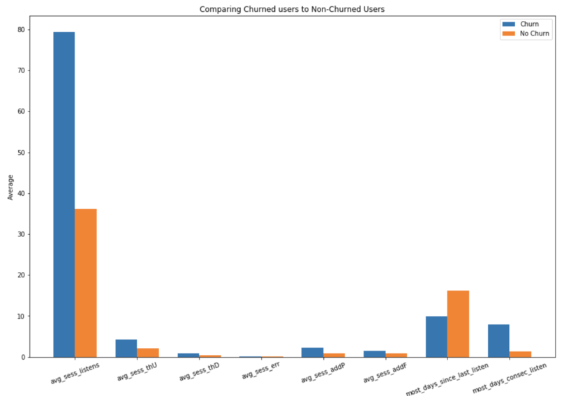
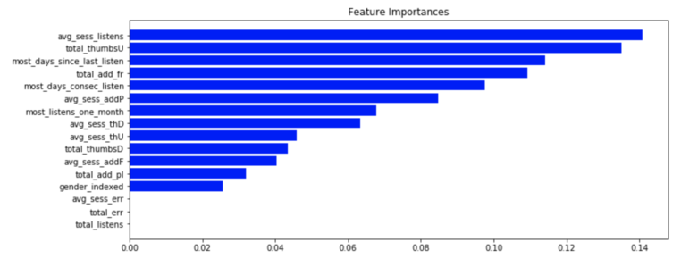
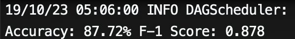

# Predicting Customer Churn
Sparkify is an imaginary music app company, and we used a small subset (128MB) of their user activity data to predict churn, then extend the same analysis to a larger dataset (12GB) on an AWS EMR cluster. 

Much more information on this analysis and interpretation of the results can be found in [this blog post on Medium]() and in the Jupyter notebook provided in this repo.

I analyzed the smaller dataset then created a data transformation & machine learning workflow within a Jupyter notebook, then extended this to the larger dataset using a 4-node cluster using AWS EMR.

## Files in this Repo

* **SparkifyAnalysis.ipynb**: this is the Spark notebook which contains all the code for the analysis on the smaller dataset.
* **SparkifyAnalysis.html**: an HTML version of the notebook
* **spaykify_script.py**: a Python script version of the notebook analysis meant to run in AWS EMR
* **.gitignore**: git utility file to prevent uploading certain files
* **images**: images used in the README

## Analysis

The data provided is in transactional event format. Each row relates to one unique user performing some activity (i.e. listen to a song, visit home page, etc.). After cleaning and exploring the data, features were created to better understand how each user behaves, such as...
- the most consecutive days a user listens to a song
- average listens, thumbs ups, add to playlists, etc. per session
- total errors, listens, thumbs ups, etc.

Here's a comparison of our churn vs no-churn users on my engineered features:

Using a tighter user-metric matrix (a matrix where users are the rows, and metrics are the engineered features understanding user activity), I then tested out various classification models (`LogisticRegression`, `RandomForestClassifier`,`GBTClassifier`). 

From there, I choose to tune a `GBTClassifier` model further through a `CrossValidator` and `ParamGridBuilder`, performing the GridSearch algorithm on 3 folds corss validation with accuracy as the optimization metric. 

After hyperparameter tuning, we have a model which had 82.35% accuracy and 0.831 F-1 Score on the test set (from the smaller dataset). This was about a 3% and .04 improvement on initial accuracy and F-1 Score respectively.

After looking at feature importances from the `GBTClassifier`, I found that these were the top three most important features:
- Average song plays per session
- Total thumbs ups
- Most consecutive days not playing songs

For your reference, here's an image of the calculated feature importances:

And here's how the final model trained on 12GB of data performed on test data:

## Possible Improvements

A lot more features can be engineered from user activity, such as thumbs-ups per day/week/month, thumbs ups to thumbs downs ratio, etc. Feature engineering can improve results better than simply optimizing one algorithm.

Thus, further work can be done extracting more features from our transactional user data to improve our predictions!

Once a model is created, perhaps it can be deployed in production and run every x-amount of days or hours. Once we have a prediction on a user that is likely to churn, we have an opportunity to intervene!

To evaluate how well this hypothetically deployed model does, we can run some proof-of-concept analysis and not intervene on its predictions for a given testing period. If the users it predicts will churn end up churning at a higher rate than the average user, this can indicate that our model is working correctly!

## Dependencies
- pyspark
- numpy
- pandas
- matplotlib
- seaborn